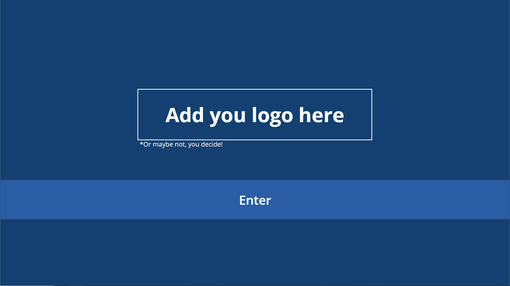
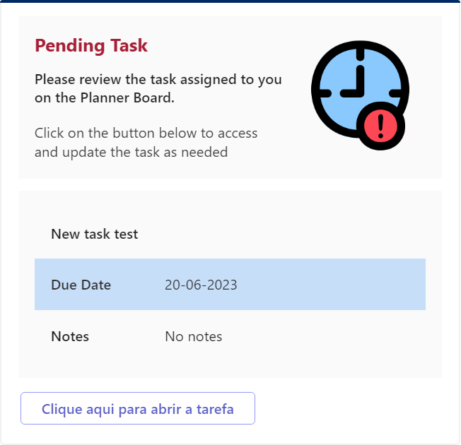

## PlannerControllerApp
App developed in Power Platform (Power Apps &amp; Power Automate)
*This app is mainly for practice and study purposes. I used Power Apps, Power Automate, Adaptive Cards and some different connectors.

The app is used to help control and reduce time in Daily Meetings using MS Planner. The approach is to reduce discussion around task by using a customized notification button. There’s also room to include any KPI’s, daily report pages and any thing you find relevant for your team.

There’s a page included with the app that explains the variables and guidelines how to use the app.

Any Power Automate Flows are also included.

## Deployment Instructions
1.  Download the Planner Controller App Zip file
2.  Go to make.powerapps.com
3.  Import the Planner Controller App Zip file into Power Apps
4.  Make sure the flows are turned on. 
5.  Open the app in edit mode and use it as you wish!  
